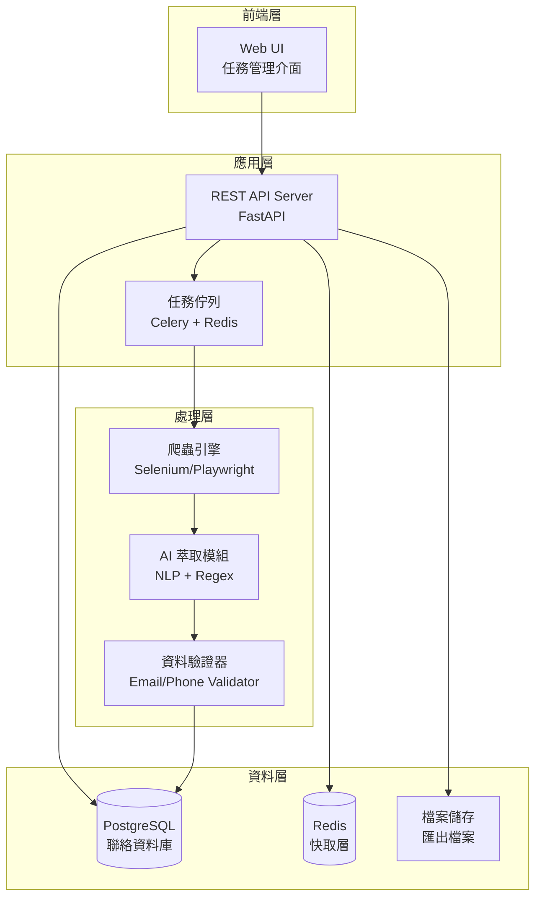

# 設計文件

## 概述

慈濟大學招生通路自動開發系統採用微服務架構，將網頁爬蟲、AI 資訊萃取、任務調度和資料管理分離為獨立模組。系統使用 Python 作為主要開發語言，結合 Selenium/Playwright 進行動態網頁爬取，使用 NLP 技術進行聯絡資訊萃取，並採用關聯式資料庫儲存結構化資料。

系統設計重點：
- **可擴展性**：支援多任務並行執行和水平擴展
- **穩定性**：實現錯誤處理、重試機制和反爬蟲對策
- **準確性**：使用 AI 模型提高聯絡資訊萃取的精確度
- **易用性**：提供直觀的 Web 介面和清晰的資料匯出功能
- **多國家支援**：支援 11 個亞洲國家和地區，根據不同國家提供相應的搜尋關鍵字和 Google 域名

## 架構

### 系統架構圖



### 技術堆疊

**後端**
- Python 3.11+
- FastAPI：REST API 框架
- Celery：分散式任務佇列
- Redis：訊息佇列和快取
- PostgreSQL：主要資料庫
- SQLAlchemy：ORM

**爬蟲與萃取**
- Selenium/Playwright：瀏覽器自動化
- BeautifulSoup4：HTML 解析
- spaCy/transformers：NLP 處理
- Regex：模式匹配

**前端**
- React/Vue.js：使用者介面
- Tailwind CSS：樣式框架
- Axios：HTTP 客戶端

**部署**
- Docker：容器化
- Docker Compose：本地開發
- Nginx：反向代理

## 元件與介面

### 1. Web UI（使用者介面）

**職責**
- 提供任務建立和管理介面
- 顯示任務執行狀態和進度
- 提供資料查詢和匯出功能
- 顯示系統統計和錯誤日誌

**主要頁面**
- 任務管理頁面：建立、編輯、刪除搜尋任務
- 儀表板：顯示統計資料和系統狀態
- 資料庫瀏覽頁面：查詢和篩選聯絡資訊
- 匯出頁面：設定匯出參數並下載檔案

### 2. REST API Server

**職責**
- 處理前端請求
- 管理任務生命週期
- 提供資料查詢和匯出 API
- 實現身份驗證和授權

**主要端點**

```
POST   /api/tasks              # 建立新任務
GET    /api/tasks              # 獲取任務列表
GET    /api/tasks/{id}         # 獲取任務詳情
DELETE /api/tasks/{id}         # 刪除任務
POST   /api/tasks/{id}/start   # 啟動任務

GET    /api/contacts           # 查詢聯絡資訊
GET    /api/contacts/{id}      # 獲取單筆資料
POST   /api/contacts/export    # 匯出資料

GET    /api/stats              # 獲取統計資料
GET    /api/logs               # 獲取系統日誌
```

**介面定義**

```python
# 任務建立請求
class TaskCreateRequest:
    country: str              # 國家代碼（如 "ID", "MY", "SG"）
    keyword: str              # 搜尋關鍵字
    city: str                 # 城市
    target_platforms: List[str]  # ["website", "facebook", "instagram"]
    max_results: int          # 最大結果數
    schedule: Optional[str]   # Cron 表達式（可選）

# 任務回應
class TaskResponse:
    id: str
    country: str
    keyword: str
    city: str
    status: str              # "pending", "running", "completed", "failed"
    progress: int            # 0-100
    created_at: datetime
    completed_at: Optional[datetime]
    results_count: int
    error_message: Optional[str]
```

### 3. 任務佇列系統（Celery + Redis）

**職責**
- 管理任務佇列
- 調度任務執行
- 處理任務優先級
- 實現任務重試機制

**任務類型**
- `scrape_google_task`：Google 搜尋爬取任務
- `extract_website_task`：官網資訊萃取任務
- `extract_social_task`：社群媒體萃取任務
- `export_data_task`：資料匯出任務

**配置**
- 並行工作者數量：4-8（可調整）
- 任務超時時間：300 秒
- 重試次數：3 次
- 重試延遲：指數退避（5s, 25s, 125s）

### 4. 爬蟲引擎（Scraping Engine）

**職責**
- 模擬瀏覽器行為
- 執行 Google 搜尋
- 抓取網頁內容
- 處理動態載入內容
- 實現反爬蟲對策

**核心類別**

```python
class ScrapingEngine:
    def __init__(self, headless: bool = True):
        """初始化瀏覽器驅動"""
        
    def search_google(self, query: str, country_code: str, max_pages: int = 5) -> List[SearchResult]:
        """
        執行 Google 搜尋並返回結果
        
        Args:
            query: 搜尋關鍵字
            country_code: 國家代碼（如 "ID", "MY"），用於決定 Google 域名
            max_pages: 最大搜尋頁數
            
        Returns:
            搜尋結果列表
        """
        
    def get_google_domain(self, country_code: str) -> str:
        """
        根據國家代碼獲取對應的 Google 域名
        
        Args:
            country_code: 國家代碼
            
        Returns:
            Google 域名（如 "google.co.id"）
        """
        
    def fetch_page(self, url: str) -> PageContent:
        """抓取單一網頁內容"""
        
    def find_contact_page(self, base_url: str) -> Optional[str]:
        """尋找聯絡頁面"""
        
    def close(self):
        """關閉瀏覽器"""
```

**反爬蟲策略**
- 隨機 User-Agent 輪換
- 請求間隔隨機延遲（2-5 秒）
- 使用代理 IP 池（可選）
- 模擬人類行為（滑鼠移動、滾動）
- Cookie 和 Session 管理

### 5. AI 萃取模組（AI Extraction Module）

**職責**
- 從網頁內容中萃取聯絡資訊
- 識別 Email 和 WhatsApp 號碼
- 處理多種格式變化
- 驗證萃取結果的有效性

**核心類別**

```python
class ContactExtractor:
    def __init__(self):
        """初始化 NLP 模型和正則表達式"""
        
    def extract_emails(self, text: str) -> List[str]:
        """萃取 Email 地址"""
        
    def extract_whatsapp(self, text: str) -> List[str]:
        """萃取 WhatsApp 號碼"""
        
    def extract_from_html(self, html: str) -> ContactInfo:
        """從 HTML 中萃取聯絡資訊"""
        
    def extract_from_social_media(self, platform: str, content: str) -> ContactInfo:
        """從社群媒體內容萃取資訊"""
```

**萃取模式**

Email 模式：
```regex
# 基本 Email 格式
[a-zA-Z0-9._%+-]+@[a-zA-Z0-9.-]+\.[a-zA-Z]{2,}

# 印尼特定域名
.*@.*\.(co\.id|ac\.id|sch\.id|or\.id)

# 常見前綴
(info|contact|admin|humas|admission)@.*
```

WhatsApp 模式：
```regex
# 印尼手機號碼
(\+62|0)8[0-9]{8,11}

# WhatsApp 標記
(WA|WhatsApp|wa)[\s:：]+(\+62|0)8[0-9]{8,11}

# 國際格式
\+62[\s-]?8[\s-]?[0-9]{2,4}[\s-]?[0-9]{4,8}
```

**NLP 增強**
- 使用預訓練模型識別聯絡資訊上下文
- 實體識別（Named Entity Recognition）
- 文本清理和標準化

### 6. 多國家配置管理（Country Configuration Manager）

**職責**
- 管理國家、關鍵字、城市的對應關係
- 提供國家特定的 Google 搜尋域名
- 支援前端動態載入國家相關選項

**配置結構**

前端配置檔案（`frontend/src/config/formOptions.js`）：

```javascript
// 國家列表及其 Google 域名
export const countries = [
  { code: 'ID', name: '印尼 (Indonesia)', domain: 'google.co.id' },
  { code: 'MY', name: '馬來西亞 (Malaysia)', domain: 'google.com.my' },
  { code: 'SG', name: '新加坡 (Singapore)', domain: 'google.com.sg' },
  // ... 其他國家
];

// 國家對應的關鍵字
export const countryKeywords = {
  'ID': ['Sekolah Internasional', 'Pusat Bahasa Mandarin', ...],
  'MY': ['International School', '獨立中學', '華文中學', ...],
  'SG': ['International School', '國際學校', 'Language School', ...],
  // ... 其他國家
};

// 國家對應的城市
export const countryCities = {
  'ID': ['Jakarta', 'Surabaya', 'Bandung', ...],
  'MY': ['Kuala Lumpur', 'Seberang Perai', 'Kajang', ...],
  'SG': ['Bedok', 'Tampines', 'Jurong West', ...],
  // ... 其他國家
};
```

**API 端點**

```
GET /api/config/countries        # 獲取支援的國家列表
GET /api/config/keywords/{country}  # 獲取特定國家的關鍵字
GET /api/config/cities/{country}    # 獲取特定國家的城市列表
```

**使用流程**

1. 使用者選擇國家
2. 前端根據國家代碼從 `countryKeywords` 和 `countryCities` 載入對應選項
3. 使用者選擇關鍵字和城市
4. 提交任務時，後端使用國家對應的 Google 域名進行搜尋

### 7. 資料驗證器（Data Validator）

**職責**
- 驗證 Email 格式和域名
- 驗證電話號碼格式
- 檢查重複資料
- 資料品質評分

**驗證規則**

```python
class ContactValidator:
    def validate_email(self, email: str) -> ValidationResult:
        """
        驗證 Email：
        - 格式檢查
        - 域名 DNS 檢查（可選）
        - 黑名單檢查
        """
        
    def validate_phone(self, phone: str, country: str = "ID") -> ValidationResult:
        """
        驗證電話號碼：
        - 格式檢查
        - 國家代碼驗證
        - 號碼長度驗證
        """
        
    def check_duplicate(self, contact: ContactInfo) -> bool:
        """檢查資料庫中是否存在重複資料"""
        
    def calculate_quality_score(self, contact: ContactInfo) -> float:
        """
        計算資料品質分數（0-100）：
        - 有 Email：+40
        - 有 WhatsApp：+40
        - 來源為官網：+10
        - 資訊完整度：+10
        """
```

## 資料模型

### 資料庫 Schema

```sql
-- 任務表
CREATE TABLE tasks (
    id UUID PRIMARY KEY DEFAULT gen_random_uuid(),
    country VARCHAR(10) NOT NULL,
    keyword VARCHAR(255) NOT NULL,
    city VARCHAR(100) NOT NULL,
    target_platforms TEXT[] NOT NULL,
    max_results INTEGER DEFAULT 100,
    status VARCHAR(20) NOT NULL,
    progress INTEGER DEFAULT 0,
    results_count INTEGER DEFAULT 0,
    error_message TEXT,
    created_at TIMESTAMP DEFAULT CURRENT_TIMESTAMP,
    started_at TIMESTAMP,
    completed_at TIMESTAMP,
    created_by VARCHAR(100)
);

-- 聯絡資訊表
CREATE TABLE contacts (
    id UUID PRIMARY KEY DEFAULT gen_random_uuid(),
    task_id UUID REFERENCES tasks(id) ON DELETE CASCADE,
    country VARCHAR(10) NOT NULL,
    institution_name VARCHAR(500) NOT NULL,
    institution_type VARCHAR(50),
    source_url TEXT NOT NULL,
    source_platform VARCHAR(20) NOT NULL,
    email VARCHAR(255),
    whatsapp VARCHAR(50),
    additional_info JSONB,
    quality_score FLOAT,
    is_verified BOOLEAN DEFAULT FALSE,
    extracted_at TIMESTAMP DEFAULT CURRENT_TIMESTAMP,
    UNIQUE(source_url, email, whatsapp)
);

-- 爬取日誌表
CREATE TABLE scraping_logs (
    id UUID PRIMARY KEY DEFAULT gen_random_uuid(),
    task_id UUID REFERENCES tasks(id) ON DELETE CASCADE,
    url TEXT NOT NULL,
    action VARCHAR(50) NOT NULL,
    status VARCHAR(20) NOT NULL,
    error_message TEXT,
    response_time INTEGER,
    created_at TIMESTAMP DEFAULT CURRENT_TIMESTAMP
);

-- 索引
CREATE INDEX idx_tasks_status ON tasks(status);
CREATE INDEX idx_tasks_country ON tasks(country);
CREATE INDEX idx_tasks_created_at ON tasks(created_at DESC);
CREATE INDEX idx_contacts_task_id ON contacts(task_id);
CREATE INDEX idx_contacts_country ON contacts(country);
CREATE INDEX idx_contacts_institution_type ON contacts(institution_type);
CREATE INDEX idx_contacts_extracted_at ON contacts(extracted_at DESC);
CREATE INDEX idx_contacts_quality_score ON contacts(quality_score DESC);
CREATE INDEX idx_scraping_logs_task_id ON scraping_logs(task_id);
```

### 資料模型類別

```python
from sqlalchemy import Column, String, Integer, Float, Boolean, DateTime, ARRAY, JSON
from sqlalchemy.dialects.postgresql import UUID
from datetime import datetime
import uuid

class Task(Base):
    __tablename__ = 'tasks'
    
    id = Column(UUID(as_uuid=True), primary_key=True, default=uuid.uuid4)
    country = Column(String(10), nullable=False)
    keyword = Column(String(255), nullable=False)
    city = Column(String(100), nullable=False)
    target_platforms = Column(ARRAY(String), nullable=False)
    max_results = Column(Integer, default=100)
    status = Column(String(20), nullable=False)
    progress = Column(Integer, default=0)
    results_count = Column(Integer, default=0)
    error_message = Column(String)
    created_at = Column(DateTime, default=datetime.utcnow)
    started_at = Column(DateTime)
    completed_at = Column(DateTime)
    created_by = Column(String(100))

class Contact(Base):
    __tablename__ = 'contacts'
    
    id = Column(UUID(as_uuid=True), primary_key=True, default=uuid.uuid4)
    task_id = Column(UUID(as_uuid=True), ForeignKey('tasks.id'))
    country = Column(String(10), nullable=False)
    institution_name = Column(String(500), nullable=False)
    institution_type = Column(String(50))
    source_url = Column(String, nullable=False)
    source_platform = Column(String(20), nullable=False)
    email = Column(String(255))
    whatsapp = Column(String(50))
    additional_info = Column(JSON)
    quality_score = Column(Float)
    is_verified = Column(Boolean, default=False)
    extracted_at = Column(DateTime, default=datetime.utcnow)

class ScrapingLog(Base):
    __tablename__ = 'scraping_logs'
    
    id = Column(UUID(as_uuid=True), primary_key=True, default=uuid.uuid4)
    task_id = Column(UUID(as_uuid=True), ForeignKey('tasks.id'))
    url = Column(String, nullable=False)
    action = Column(String(50), nullable=False)
    status = Column(String(20), nullable=False)
    error_message = Column(String)
    response_time = Column(Integer)
    created_at = Column(DateTime, default=datetime.utcnow)
```

## 錯誤處理

### 錯誤類型與處理策略

**1. 網路錯誤**
- 連線超時：重試 3 次，指數退避
- DNS 解析失敗：記錄錯誤，跳過該 URL
- HTTP 錯誤（4xx, 5xx）：根據狀態碼決定是否重試

**2. 爬蟲被封鎖**
- 檢測到 CAPTCHA：暫停任務，通知管理員
- IP 被封鎖：切換代理 IP（如有配置）
- Rate Limiting：增加請求間隔，重試

**3. 資料萃取失敗**
- 找不到聯絡頁面：嘗試其他常見路徑（/contact, /about, /hubungi-kami）
- 無法萃取資訊：記錄原始 HTML，標記為需人工審查
- 格式驗證失敗：記錄原始文本，嘗試其他萃取模式

**4. 資料庫錯誤**
- 連線失敗：重試連線，使用連線池
- 重複鍵衝突：更新現有記錄的時間戳
- 交易失敗：回滾並重試

### 錯誤日誌格式

```python
class ErrorLog:
    timestamp: datetime
    task_id: str
    error_type: str
    error_code: str
    url: Optional[str]
    message: str
    stack_trace: Optional[str]
    retry_count: int
    resolved: bool
```

### 監控與告警

**監控指標**
- 任務成功率
- 平均萃取時間
- 錯誤率（按類型分類）
- 資料品質分數分佈
- 系統資源使用率

**告警條件**
- 錯誤率超過 20%
- 任務執行時間超過 30 分鐘
- 資料庫連線失敗
- 磁碟空間不足

## 測試策略

### 單元測試

**測試範圍**
- ContactExtractor：測試各種格式的 Email 和 WhatsApp 萃取
- ContactValidator：測試驗證邏輯
- 資料模型：測試 CRUD 操作
- API 端點：測試請求和回應

**測試工具**
- pytest：測試框架
- pytest-mock：模擬外部依賴
- pytest-cov：程式碼覆蓋率

### 整合測試

**測試場景**
- 完整任務流程：從建立任務到資料儲存
- 爬蟲引擎：使用測試網站驗證爬取功能
- API 整合：測試前後端互動
- 資料庫操作：測試交易和並行存取

### 端對端測試

**測試流程**
1. 建立測試任務（使用真實關鍵字）
2. 執行爬取和萃取
3. 驗證資料庫中的結果
4. 測試資料匯出功能
5. 清理測試資料

**測試環境**
- 使用 Docker Compose 建立隔離環境
- 使用測試資料庫
- 模擬外部服務（如需要）

### 效能測試

**測試指標**
- 單一任務處理時間
- 並行任務處理能力
- 資料庫查詢效能
- API 回應時間

**測試工具**
- Locust：負載測試
- pytest-benchmark：效能基準測試

## 部署架構

### Docker 容器化

```yaml
# docker-compose.yml
version: '3.8'

services:
  api:
    build: ./backend
    ports:
      - "8000:8000"
    environment:
      - DATABASE_URL=postgresql://user:pass@db:5432/recruitment
      - REDIS_URL=redis://redis:6379/0
    depends_on:
      - db
      - redis
  
  worker:
    build: ./backend
    command: celery -A app.celery worker --loglevel=info
    environment:
      - DATABASE_URL=postgresql://user:pass@db:5432/recruitment
      - REDIS_URL=redis://redis:6379/0
    depends_on:
      - db
      - redis
  
  frontend:
    build: ./frontend
    ports:
      - "3000:3000"
    depends_on:
      - api
  
  db:
    image: postgres:15
    environment:
      - POSTGRES_USER=user
      - POSTGRES_PASSWORD=pass
      - POSTGRES_DB=recruitment
    volumes:
      - postgres_data:/var/lib/postgresql/data
  
  redis:
    image: redis:7-alpine
    ports:
      - "6379:6379"

volumes:
  postgres_data:
```

### 環境配置

**開發環境**
- 本地 Docker Compose
- 熱重載啟用
- 詳細日誌輸出

**生產環境**
- 容器編排（Docker Swarm 或 Kubernetes）
- 負載平衡
- 自動擴展
- 日誌聚合（ELK Stack）
- 監控（Prometheus + Grafana）

## 安全考量

### 資料安全
- 資料庫連線加密（SSL/TLS）
- 敏感資訊加密儲存
- 定期資料備份

### API 安全
- JWT 身份驗證
- API Rate Limiting
- CORS 配置
- 輸入驗證和清理

### 爬蟲合規性
- 遵守 robots.txt
- 合理的請求頻率
- 明確的 User-Agent
- 僅爬取公開資訊

## 擴展性考量

### 水平擴展
- API 服務：無狀態設計，可增加實例
- Worker：可增加 Celery worker 數量
- 資料庫：讀寫分離，主從複製

### 功能擴展
- 支援更多搜尋引擎（Bing, Yahoo）
- 支援更多社群平台（LinkedIn, Twitter）
- 增加 AI 模型訓練功能
- 增加聯絡資訊驗證服務（Email 驗證 API）

### 效能優化
- 實現智慧快取策略
- 批次處理資料庫操作
- 使用 CDN 加速前端資源
- 資料庫查詢優化和索引調整
